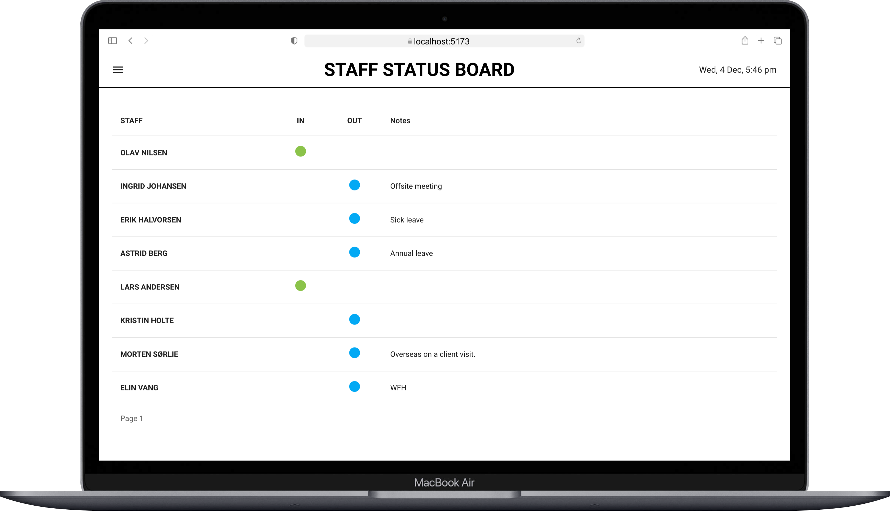

# In-Out Board

The **In-Out Board** is a React application that displays the status of staff members in a paginated table. It automatically cycles through pages at a configurable interval, making it ideal for dashboards or status boards in offices, warehouses, or other environments.

## Features

- **Dynamic Status Display**: Shows whether staff members are "In" or "Out" with clear visual indicators.
- **Pagination**: Automatically cycles through pages of staff members at a specified interval.
- **Customizable Interval**: Default interval is 30 seconds, but it can be configured as needed.
- **Responsive Design**: Built with Material-UI for a modern and responsive layout.

## Demo

 Prototype for Large Screens (e.g. TV)

## Getting Started

Follow these instructions to set up the project locally.

### Prerequisites

- **Node.js**: Version 14 or later
- **npm**: Version 6 or later

### Installation

1. Clone the repository:
   ```bash
   git clone https://github.com/steven2k2/in-out-board.git
   cd in-out-board
   ```

2. Install dependencies:
   ```bash
   npm install
   ```

3. Start the development server:
   ```bash
   npm start
   ```

4. Open the application in your browser:
   ```
   http://localhost:5173
   ```

## Usage

### Example Data
Provide staff data as a prop to the component:
```javascript
const staff = [
  { id: '1', name: 'John Doe', status: 'in', notes: 'Available' },
  { id: '2', name: 'Jane Smith', status: 'out', notes: 'On leave' },
  { id: '3', name: 'Michael Brown', status: 'in', notes: 'Working remotely' },
];

<StaffStatusBoard staff={staff} interval={30000} />
```

### Customization
- **Pagination Interval**: The `interval` prop sets the time (in milliseconds) between automatic page changes. Default is 30 seconds.
- **Rows Per Page**: The number of staff members displayed per page is set to 10 but can be adjusted in the code.

## Technologies Used

- **React**: For building the user interface.
- **Material-UI**: For components and styling.
- **JavaScript**: Core logic and interactivity.

## Project Structure

```
in-out-board/
├── public/              # Static assets
├── src/                 # Source code
│   ├── components/      # React components
│   ├── App.jsx          # Root application component
│   ├── main.jsx         # Entry point
├── dist/                # Production build (auto-generated)
├── .github/             # GitHub Actions workflow
│   └── workflows/
│       └── deploy.yml   # Deployment workflow
├── package.json         # Project configuration
├── vite.config.js       # Vite configuration
└── README.md            # Project documentation
```

## Contributing

Contributions are welcome! Please fork the repository and submit a pull request with your changes.

1. Fork the repository.
2. Create a feature branch:
   ```bash
   git checkout -b feature-name
   ```
3. Commit your changes:
   ```bash
   git commit -m "Add your message here"
   ```
4. Push to the branch:
   ```bash
   git push origin feature-name
   ```
5. Open a pull request on GitHub.

## License

This project is licensed under the MIT License. See the [LICENSE](LICENSE) file for details.

